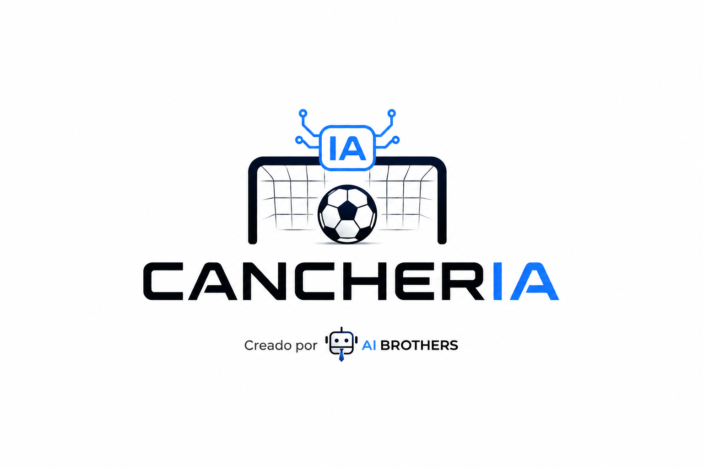
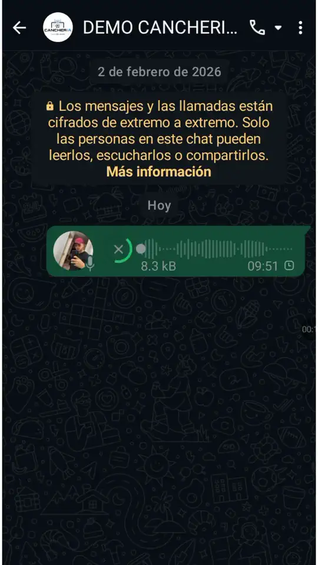
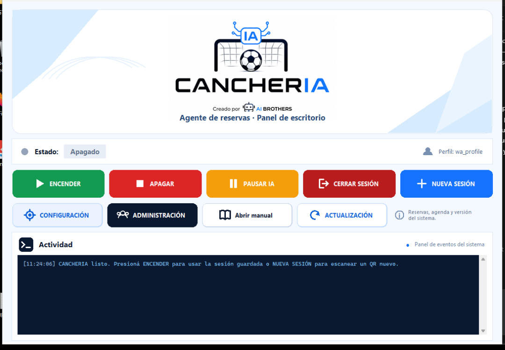
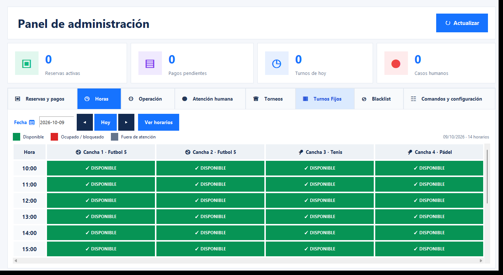

<p align="center">
  
</p>

<h1 align="center">CANCHERIA</h1>
<h3 align="center">El primer Agente IA de reservas para complejos deportivos totalmente gratuito</h3>

<p align="center">
  <strong>Contacto y soporte · Sebastián Bocek</strong><br>
  Email: <a href="mailto:sebastianbocek.marketing@gmail.com">sebastianbocek.marketing@gmail.com</a><br>
  WhatsApp: <a href="https://wa.me/5493513441882">+54 9 351 344-1882</a><br>
  LinkedIn: <a href="https://www.linkedin.com/in/sebastianbocek/">Sebastián Bocek</a>
</p>

<p align="center">
  Atiende consultas por WhatsApp, informa disponibilidad, crea reservas, controla señas y pagos,<br>
  administra canchas y deriva casos complejos a una persona.
</p>

<p align="center">
  <a href="https://github.com/sebastianbocek/CANCHERIA/releases/download/v0.2.22/InstaladorCancheria.exe"><strong>⬇️ Descargar para Windows</strong></a>
  &nbsp;&nbsp;·&nbsp;&nbsp;
  <a href="https://github.com/sebastianbocek/CANCHERIA/releases/download/v0.2.22/InstaladorCancheriaLinux.run"><strong>⬇️ Descargar para Debian</strong></a>
</p>

<p align="center">
  <a href="https://github.com/sebastianbocek/CANCHERIA/releases/tag/v0.2.22">Ver versión v0.2.22</a>
  ·
  <a href="docs/MANUAL_DE_USO_CANCHERIA_DUENOS_ENCARGADOS.pdf">Manual completo</a>
</p>

---

## ¿Qué es CANCHERIA?

CANCHERIA es un agente de inteligencia artificial pensado para complejos de fútbol, pádel, tenis y otros espacios que trabajan con turnos. Funciona sobre WhatsApp Web y mantiene una conversación natural con cada cliente mientras consulta datos reales de disponibilidad y reservas.

El dueño o encargado puede operar el sistema desde el panel de escritorio, desde el panel visual de administración o enviando comandos por WhatsApp desde números autorizados.

El software de CANCHERIA se distribuye sin costo de licencia. Para responder con IA, cada instalación utiliza una API key propia de OpenAI; el consumo de esa API, Internet y la computadora o servidor son servicios externos y pueden tener costo.

## Funciones principales

- Atención automática de consultas por WhatsApp.
- Interpretación de fechas y horarios expresados de forma natural.
- Disponibilidad real por día, hora y cancha.
- Reservas, reprogramaciones y cancelaciones.
- Señas fijas o porcentuales y seguimiento de saldos.
- Confirmación de pagos y comprobantes.
- Múltiples canchas, deportes, precios y duraciones.
- Quinchos, parrillas y servicios adicionales.
- Lista de espera y turnos fijos semanales.
- Bloqueos por lluvia, mantenimiento, feriados o eventos.
- Torneos e inscripciones de equipos.
- Recordatorios, seguimiento y métricas operativas.
- Detección de casos que necesitan atención humana.
- Blacklist y múltiples administradores autorizados.
- Panel de administración con agenda visual por horas.
- Gestión visual de torneos e inscripciones desde Administración.
- Calendario visual para elegir fechas en Horas y Torneos.
- Íconos deportivos sincronizados entre la agenda visual y WhatsApp, editables con clic derecho.
- Alertas rojas automáticas en Administración y en la pestaña que necesita atención.
- Sesión de WhatsApp persistente: no es necesario escanear el QR en cada inicio.
- Respaldo automático antes de cada actualización.
- Actualización directa desde **⚙ Ajustes**, sin descargar manualmente otro instalador.

## Capturas del programa

### Demo de una interacción básica

La siguiente demostración muestra una conversación real de reserva con CANCHERIA. La vista previa se reproduce directamente en el README; hacé clic sobre ella para abrir el video completo con audio.

<p align="center">
  <a href="https://github.com/sebastianbocek/CANCHERIA/releases/download/v0.2.22/DEMO-CANCHERIA-CHAT.mp4">
    
  </a>
</p>

<p align="center">
  <a href="https://github.com/sebastianbocek/CANCHERIA/releases/download/v0.2.22/DEMO-CANCHERIA-CHAT.mp4"><strong>▶ Ver demo completa con audio</strong></a>
</p>

### Panel principal

Desde aquí se enciende o pausa el agente, se administra la sesión de WhatsApp y se abren la configuración, la administración y el manual.



### Agenda visual por horas

La pestaña **Horas** muestra cada horario y cancha en una grilla: verde cuando está disponible, rojo cuando está ocupado o bloqueado y gris cuando el horario ya pasó o está fuera de atención. Al seleccionar una celda se puede crear, editar, cancelar, bloquear o desbloquear un turno.



---

## Instalación rápida

### Windows 10 y Windows 11

1. Descargá **[InstaladorCancheria.exe](https://github.com/sebastianbocek/CANCHERIA/releases/download/v0.2.22/InstaladorCancheria.exe)**.
2. Cerrá una instalación anterior de CANCHERIA si estuviera abierta.
3. Ejecutá `InstaladorCancheria.exe` y seguí el asistente.
4. Dejá marcada la opción **Configurar mi negocio ahora**.
5. Completá los datos del complejo y guardá.
6. Abrí **CANCHERIA** desde el escritorio o el menú Inicio.
7. Presioná **NUEVA SESIÓN** y escaneá el QR de WhatsApp.

El instalador agrega accesos directos para **CANCHERIA** y **Configurar CANCHERIA**. La instalación predeterminada queda dentro del perfil del usuario de Windows.

### Debian con escritorio gráfico

Requisitos:

- Debian 12 o posterior.
- Escritorio gráfico funcionando.
- Usuario normal con acceso a `sudo`.
- Conexión a Internet.

1. Descargá **[InstaladorCancheriaLinux.run](https://github.com/sebastianbocek/CANCHERIA/releases/download/v0.2.22/InstaladorCancheriaLinux.run)**.
2. Abrí una terminal en la carpeta de descarga.
3. Ejecutá el instalador con tu usuario normal, sin anteponer `sudo`:

```bash
bash InstaladorCancheriaLinux.run
```

4. El instalador pedirá la contraseña de `sudo` solamente para instalar Python, Tkinter y Chromium.
5. Abrí **Configurar CANCHERIA** desde el menú de aplicaciones.
6. Guardá la configuración y abrí **CANCHERIA**.
7. Presioná **NUEVA SESIÓN** y escaneá el QR.

La aplicación queda instalada en:

```text
~/.local/share/CANCHERIA
```

La instalación de Debian utiliza Chromium y crea accesos en el menú de aplicaciones y, cuando el escritorio lo permite, también en el escritorio.

### Verificación de las descargas

La página de la versión incluye `SHA256SUMS.txt` con los hashes SHA-256 de ambos instaladores. Descargalo junto con el instalador para comprobar que el archivo llegó completo y corresponde a la publicación oficial.

---

## Configuración inicial

El configurador visual permite cargar los datos sin editar código:

- API key propia de OpenAI.
- Nombre del complejo y nombre del asistente.
- Dirección y alias de pago.
- Número principal y administradores autorizados.
- Canchas, deportes y precios.
- Duración de los turnos.
- Días y franjas horarias de atención.
- Seña fija o porcentual.
- Quinchos, parrillas y servicios.
- Datos de contacto para atención humana.

Al guardar, CANCHERIA coloca la API key en el `config.py` operativo y la comprueba
directamente con OpenAI. Si la clave
es inválida, está incompleta o el proyecto no puede usar la API, la configuración
no se guarda y se muestra una explicación. La clave nunca se publica en GitHub.

Después de guardar una modificación, reiniciá el agente si ya estaba encendido para que toda la configuración vuelva a cargarse.

### API key de OpenAI

CANCHERIA no incluye una API key. Cada usuario debe crear y administrar la suya, cargarla en el configurador y controlar su consumo. Nunca publiques esa clave en GitHub, capturas, logs o archivos compartidos.

---

## Uso del panel principal

| Botón | Función |
|---|---|
| **ENCENDER** | Inicia CANCHERIA y abre WhatsApp Web usando la sesión guardada. Una API vacía o inválida no impide iniciar WhatsApp ni las alertas. |
| **APAGAR** | Detiene completamente la automatización y cierra el navegador, conservando la sesión. |
| **PAUSAR IA / REANUDAR IA** | Suspende o restablece solamente las respuestas automáticas, manteniendo WhatsApp abierto. |
| **CERRAR SESIÓN** | Elimina solamente la sesión local de WhatsApp; no borra reservas ni configuración. |
| **NUEVA SESIÓN** | Limpia el perfil anterior y abre WhatsApp para escanear un QR nuevo. |
| **CONFIGURACIÓN** | Abre el configurador visual del complejo. |
| **ADMINISTRACIÓN** | Abre reservas, pagos, agenda por horas, operación, casos humanos, torneos, turnos fijos y blacklist. |
| **Abrir manual** | Abre el manual PDF incluido con el programa. |

## Panel de administración

El panel visual permite trabajar sin recordar comandos:

- **Reservas y pagos:** ver reservas activas y pagos pendientes, crear reservas
  manuales, confirmar una seña o el pago total, liberar pendientes y cancelar
  reservas.
- **Horas:** consultar la agenda visual por fecha y cancha, distinguir horarios
  libres y ocupados, y crear, editar o cancelar un turno desde su celda. Las
  horas que ya pasaron se ocultan para que la agenda del día muestre solamente
  horarios útiles. Cada cancha presenta el icono de su deporte; con clic derecho
  sobre su encabezado se puede cambiar el deporte y sincronizar ese dato con la
  disponibilidad que CANCHERIA informa por WhatsApp.
- **Operación:** revisar el estado operativo del complejo, seleccionar una fecha
  desde el calendario y administrar bloqueos o disponibilidad de la jornada.
- **Atención humana:** consultar los casos derivados por el agente, ver su
  contexto y marcarlos como resueltos cuando el administrador los atiende.
- **Torneos:** crear, editar y eliminar torneos, además de gestionar sus cupos,
  inscripciones y pagos desde la GUI.
- **Turnos Fijos:** crear, editar y quitar reservas recurrentes. Sus próximas
  ocurrencias se sincronizan automáticamente con la agenda de **Horas**.
- **Blacklist:** bloquear o desbloquear números y consultar qué contactos no
  deben recibir respuestas automáticas.
- **Comandos y configuración:** consultar de forma ordenada todos los comandos
  administrativos disponibles en WhatsApp y abrir la configuración del negocio.
- Ver contadores rojos en el botón **ADMINISTRACIÓN** y en la pestaña exacta
  que tiene una acción pendiente. Abrir el panel no borra la alerta: desaparece
  únicamente al confirmar el pago o resolver el caso correspondiente.

La fecha de la pestaña **Horas** comienza siempre en el día actual y puede cambiarse para revisar o administrar cualquier otra fecha.

---

## Actualizaciones y respaldos

Desde la versión 0.2.0 podés abrir **⚙ Ajustes** en la pantalla principal,
presionar **Buscar actualizaciones** y después **Actualizar versión**. CANCHERIA
consulta la última publicación oficial de GitHub, descarga el paquete correcto,
verifica su hash SHA-256, se cierra, instala los archivos y vuelve a abrirse.

El instalador completo sigue disponible como alternativa para reparar la
instalación. Si lo usás para actualizar, ejecutalo sobre la instalación
existente y **no desinstales la versión anterior**.

Si una versión 0.2.0 o 0.2.1 muestra el error de Windows
`built-in function kill returned a result with an exception set`, instalá una
vez la versión 0.2.2 con el instalador completo. La configuración y la sesión se
conservan; desde ese momento las actualizaciones siguientes vuelven a funcionar
directamente desde **⚙ Ajustes**.

Antes de reemplazar archivos, tanto Windows como Debian crean un ZIP con la configuración y los datos privados del cliente dentro de la carpeta `Backups` de la instalación. Se conservan configuración, reservas, calendario, sesión de WhatsApp, casos humanos, memoria operativa, comprobantes, eventos y torneos.

Si una instalación muestra `ZIP does not support timestamps before 1980`,
descargá y ejecutá una vez el instalador completo v0.2.22 sobre la instalación
existente, sin desinstalarla. La configuración y la sesión se conservan. Desde
v0.2.4 los respaldos normalizan de forma segura las fechas antiguas únicamente
dentro del ZIP.

Además del ZIP, el actualizador conserva temporalmente los dos archivos de
configuración y los restaura al finalizar. Así permanecen el nombre del negocio,
el agente IA, la API key, las canchas, precios, horarios y demás preferencias.

Al comenzar la actualización desde la GUI, el agente y su navegador se detienen
automáticamente. Si un archivo no puede verificarse o reemplazarse, el auxiliar
cancela el proceso y restaura la versión anterior.

---

## Privacidad y seguridad

La información de cada complejo permanece en su instalación local. No deben publicarse ni compartirse:

- `.env` o API keys;
- `wa_profile/` o cookies del navegador;
- `runtime/`, bases de datos o CSV operativos;
- teléfonos o conversaciones de clientes;
- comprobantes de pago;
- logs de producción.

El repositorio público y los instaladores oficiales se generan desde una plantilla limpia, sin sesiones, credenciales ni datos de clientes. Consultá [SECURITY.md](SECURITY.md) para informar un problema de seguridad.

> CANCHERIA automatiza WhatsApp Web mediante un navegador. Los cambios que realice WhatsApp en su interfaz pueden requerir una actualización del programa.

---

## Ejecutar desde el código fuente

Requiere Python 3.10 o posterior, Chrome o Chromium y Tkinter.

### Windows PowerShell

```powershell
python -m venv .venv
.venv\Scripts\Activate.ps1
pip install -e ".[dev]"
python cancheria_desktop.py
```

### Debian

```bash
sudo apt update
sudo apt install -y python3 python3-venv python3-tk chromium
python3 -m venv .venv
. .venv/bin/activate
pip install -e ".[dev]"
python cancheria_desktop.py
```

### Tests

```bash
pytest -m "not live and not browser"
python scripts/security_scan.py
```

## Estructura del proyecto

```text
CANCHERIA/
├── cancheria_desktop.py          # panel principal y worker
├── configurador_cancheria.py     # configurador visual
├── WPSetter.py                   # entrada compatible del agente
├── src/cancheria/                # módulos del sistema
├── legacy/WPSetter_legacy.py     # núcleo conversacional compatible
├── installer/                    # instaladores Windows y Debian
├── scripts/                      # build, respaldo y seguridad
├── tests/                        # pruebas automatizadas
├── assets/                       # identidad visual
└── docs/                         # manuales e imágenes
```

## Construir instaladores

En Windows:

```text
build_installer.bat
```

Para generar el instalador de Debian desde Windows:

```text
build_linux_installer.bat
```

Los resultados se guardan en `release/`. Los generadores usan una configuración limpia y verifican que no se incluyan API keys ni sesiones.

## Estado de licencia

CANCHERIA `v0.2.22` se ofrece para descarga y uso sin costo de licencia. La licencia jurídica definitiva del código fuente continúa pendiente de selección por AI BROTHERS; consultá [docs/licensing.md](docs/licensing.md). Esto no afecta la descarga gratuita de los instaladores publicados.

---

# Comandos de administración por WhatsApp

Los comandos solamente se ejecutan desde números autorizados y estando en modo administrador. Para ver la ayuda directamente en WhatsApp escribí `ayuda`.

Ayuda por categoría:

```text
ayuda reservas
ayuda config
ayuda blacklist
ayuda admins
ayuda casos
ayuda reportes
ayuda torneos
ayuda datos
ayuda turnos fijos
ayuda asistencia
ayuda agente
ayuda bloqueos
```

## Modo y control del agente

```text
cambiar a admin
cambiar a usuario
estado modo
pausar agente
reanudar agente
estado agente
```

## Agenda y reservas

```text
agenda hoy
agenda mañana
agregar reserva lunes 20:00 Cancha 1 Juan
agregar reserva lunes 20:00 Cancha 1 Juan con quincho
borrar reserva mañana 21:00 Cancha 2
mostrar pendientes
listar pendientes
señas pendientes
```

## Operaciones exactas por ID

```text
ver ID 2
confirmar seña ID 2
confirmar total ID 2
mover ID 2 mañana 20
cancelar ID 2 lluvia
liberar ID 2
agregar quincho ID 2
```

## Pagos y pendientes por cliente

```text
seña pagada Juan
confirmar Juan
liberar seña Juan
liberar pendiente mañana 20 Cancha 1
```

## Lista de espera

```text
lista espera jueves 21 Cancha 1 Juan +5491100000059
lista espera
lista espera jueves 21
quitar lista espera Juan
```

## Asistencia y clientes

```text
no vino Juan
no vino Juan mañana 20 Cancha 1
clientes problema
motivos cancelacion
cancelaciones semana
```

## Turnos fijos

```text
agregar turno fijo martes 21 Cancha 1 Juan
quitar turno fijo Juan
turnos fijos
```

## Bloqueos de agenda

```text
bloquear mañana cancha 1
bloquear mañana cancha 1 mantenimiento
bloquear mañana
desbloquear cancha 1 mañana
desbloquear mañana
```

## Atención humana

```text
casos pendientes
resolver caso ID 3
continuar ID 3
continuar +5491100000059
```

El ID de un caso humano no es el mismo que el ID de una reserva.

## Blacklist

```text
bloquear +5491100000059
desbloquear +5491100000059
listar blacklist
```

## Administradores autorizados

```text
agregar admin +5491100000059
quitar admin +5491100000059
```

## Configuración del negocio

```text
configuracion actual
cambiar nombre negocio a Complejo El Gol
cambiar nombre asistente a Sofi
cambiar direccion a Av. Corrientes 1250
cambiar alias a ELOTURNO.F5
configurar 3 canchas
configurar canchas Cancha 1 tipo futbol 5, Cancha 2 tipo padel
cambiar precio 18000
cambiar precio cancha 1 20000
cambiar horario de atencion de 14hs a 23hs
cambiar dia de atencion de lunes a domingo
cambiar seña 7000
cambiar seña 50%
```

## Quinchos y parrillas

```text
activar quincho
desactivar quincho
configurar 2 quinchos
configurar quinchos Quincho Techado, Parrilla Patio
quitar quincho 2
cambiar precio quincho 10000
```

## Reportes

```text
reporte ocupación semanal
reporte ocupación mensual Cancha 1
reporte ocupación hoy hora 20
reporte facturación semanal
reporte cancelaciones mensual
reporte conversión semanal
reporte demanda mensual
resumen semanal
resumen mensual
```

También pueden utilizarse períodos como `semana pasada` o `mes pasado`.

## Torneos e inscripciones

```text
configurar torneo Copa Primavera inscripcion 120000 equipos 16 fecha 10/10/2026 premio 900000
editar torneo Copa Primavera precio 150000
editar torneo Copa Primavera premio 1000000
editar torneo Copa Primavera maximo 20
editar torneo Copa Primavera fecha 15/10/2026
editar torneo Copa Primavera nombre Copa Verano
listar torneos
borrar torneo Copa Primavera
ver ID 10001
confirmar seña ID 10001
confirmar total ID 10001
liberar ID 10001
```

## Respaldo y mantenimiento de datos

```text
exportar agenda
backup
borrar comprobantes usados
borrar used_payment_receipts.json
borrar todos los csv
```

`borrar todos los csv` es destructivo: vacía los CSV operativos y de torneos, aunque conserva los respaldos ubicados en `backups_operativos`.

---

<p align="center">
  <strong>CANCHERIA · Creado por AI BROTHERS</strong><br>
  Reservas inteligentes para complejos deportivos.
</p>
