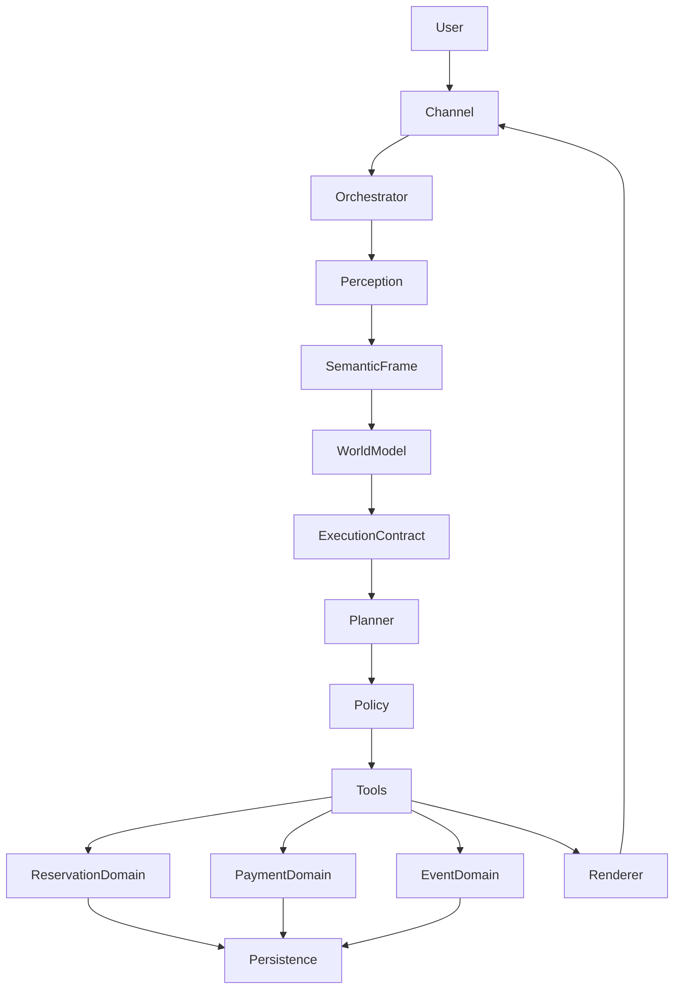

# Architecture

CANCHERIA is being migrated from a historical single-file runtime into a modular monolith.

## Dependency rule

`domain/` must remain independent from Playwright and OpenAI. Browser/API integrations live under `channels/` and `infrastructure/`.

## Compatibility layer

The production CANONICAL chain is retained in `legacy/WPSetter_legacy.py`. Public modules under `agent/` and `channels/whatsapp_web/` act as stable facades during incremental extraction. This is deliberate: moving 100+ interdependent monkey-patches at once would be a rewrite, not a conservative refactor.
